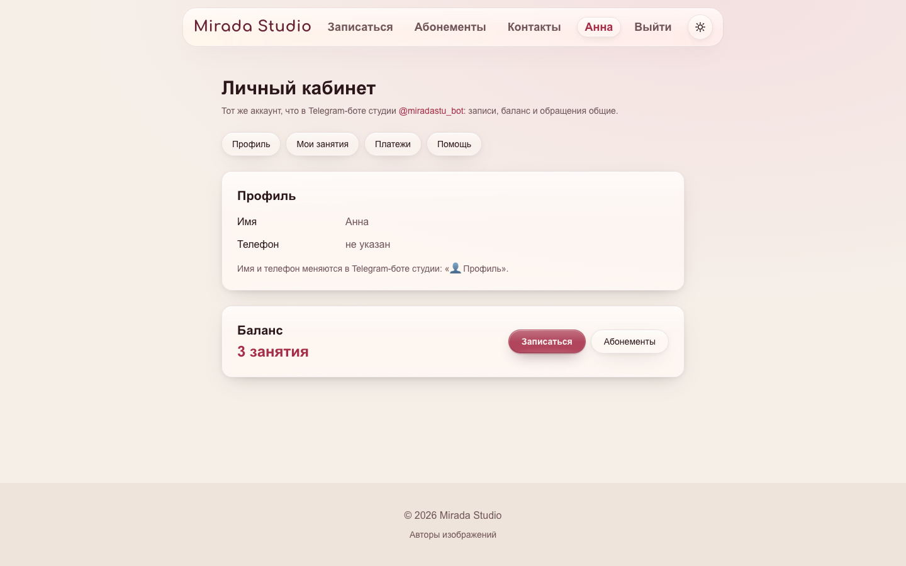
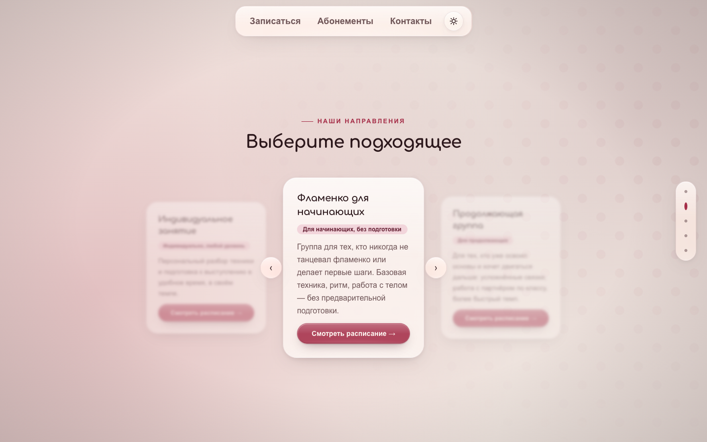
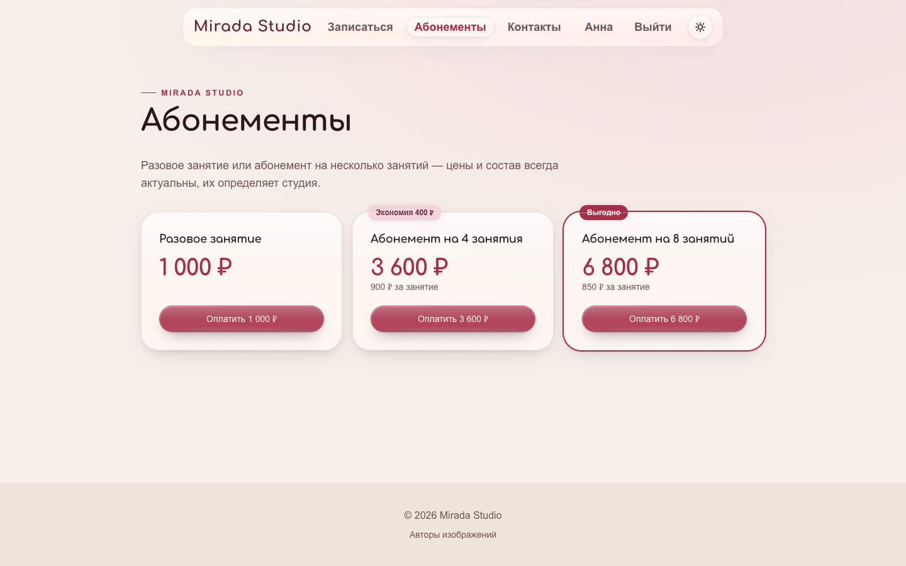

# Flamenco Studio — публичный сайт

Next.js (App Router) + TypeScript + Tailwind CSS. Второй интерфейс (рядом с
Telegram-ботом) к одному и тому же backend: сайт не хранит бизнес-данные и
не дублирует бизнес-логику бота, только отображает то, что отдаёт веб-API.

Это самостоятельный проект со своим git-репозиторием. Backend — Telegram-бот,
веб-API (FastAPI, `src/flamenco_bot/api`), миграции и PostgreSQL — живёт в
отдельном репозитории `flamenco-studio-bot` (локально — папка `TG BOT`
рядом с этой); там же `README.md` и `WEBSITE_PLAN.md` с общей архитектурой.
Единственная связь между проектами — HTTP-запросы сайта к API
(`API_BASE_URL`):

```text
FLAMENCO WEBSITE (Next.js) ──HTTP──▶ FastAPI API ──▶ PostgreSQL ◀── Telegram-бот
```

Реализовано: публичные страницы без авторизации (Stage 3 — главная,
расписание, направления, абонементы, контакты), вход через Telegram
(Stage 4 — `/login`, сессия в httponly-cookie), личный кабинет (Stage 5 —
`/account`: профиль, баланс, мои занятия, поддержка), запись на занятия
прямо из расписания (Stage 6 — кнопка «Записаться»/«Войти и записаться» на
`/schedule`) и оплата абонементов (Stage 7 — кнопка «Купить» на
`/packages`, история и проверка статуса на `/account/payments`). ЮKassa к
сайту пока не подключена: `WEB_YOOKASSA_RETURN_URL` на backend пуст, поэтому
checkout отвечает 503 — весь остальной код уже готов, см. раздел ниже.

Вход и регистрация: по email/паролю (`/login`, `/register`) и через
Telegram-бота (ссылка t.me/<бот>?start=…, подтверждение кнопкой в боте —
работает и на localhost, в отличие от Login Widget). Покупка, запись,
баланс и поддержка требуют привязанного Telegram (`/account` → «Привязать
Telegram»); аккаунт, созданный только через Telegram, при привязке
объединяется с аккаунтом по email, а такой аккаунт может задать себе email
и пароль — дублей одного человека нет. Cookie сессии ставит сам сайт
(server actions, `src/lib/authActions.ts`), `Secure` — только в production.

Админка `/admin` (сводка, расписание, участники, платежи, поддержка) и
плавающее окно «Нагрузка» на всех страницах — только для администраторов;
права проверяет backend на каждом `/api/admin/*`. Администратора создаёт
серверная команда backend `python -m flamenco_bot.api.manage create-admin`.

## Запуск

```bash
npm install
cp .env.example .env.local   # укажите API_BASE_URL и NEXT_PUBLIC_TELEGRAM_BOT_USERNAME
npm run dev                  # http://localhost:3000
npm run dev:https            # https://localhost:3000 (самоподписанный сертификат)
```

`dev:https` (`next dev --experimental-https`) при первом запуске создаёт
сертификат для localhost в `certificates/` (не коммитится) — нужен, чтобы
проверить на localhost то, что работает только по HTTPS. Из корня
`PROJECT 1` то же самое: `./start-mac.command --https`.

На `npm run dev` (`localhost`) виджет **всегда** покажет «Bot domain
invalid» — это не баг, а намеренное ограничение Telegram: виджет работает
только на настоящем публичном HTTPS-домене, привязанном к боту через
@BotFather (`/setdomain`). Подтверждено на практике, не только по
документации. Проверять живой вход имеет смысл только на реальном домене
после деплоя (Stage 6+) либо через временный HTTPS-туннель (ngrok/cloudflared)
с доменом, временно привязанным через `/setdomain`. До тех пор серверная
часть входа (`/api/auth/telegram`, cookie, `/account`) проверяется напрямую
HTTP-запросами с подписанным payload — см. коммиты Stage 4/5.

Откройте http://localhost:3000. По умолчанию сайт обращается к backend API
на `http://127.0.0.1:8000` — поднимите его отдельно, в backend-проекте:

```bash
cd "../TG BOT"
./run.sh api     # только API (или ./run.sh — API + бот)
```

Без запущенного API сайт тоже стартует, но вместо расписания, абонементов
и данных личного кабинета показывает «Сервис временно недоступен.
Попробуйте ещё раз.» — сбой API (5xx, API не отвечает, сетевая ошибка) не
выдаётся за пустые данные и не разлогинивает: на `/login` ведёт только 401
(см. `src/lib/apiResult.ts`).

Тесты: `npm test` (встроенный `node --test`, без дополнительных зависимостей).

Время занятий показывается в часовом поясе студии `STUDIO_TIMEZONE` (по
умолчанию `Europe/Moscow`, `src/lib/format.ts`) — та же переменная и то же
значение, что у backend, поэтому сайт и Telegram-бот показывают одно и то же
время. Меняя пояс, задайте его одинаково в `.env` обоих проектов.

## Переменные окружения

| Переменная | Обязательно | Назначение |
|---|:---:|---|
| `API_BASE_URL` | Нет (по умолчанию `http://127.0.0.1:8000`) | Базовый URL backend API. Запросы идут с сервера Next.js (серверные компоненты), а не из браузера — переменная намеренно без префикса `NEXT_PUBLIC_`, чтобы не попасть в клиентский бандл. |
| `NEXT_PUBLIC_TELEGRAM_BOT_USERNAME` | Для `/login` | Публичный `@username` бота для Telegram Login Widget (не секрет). Инлайнится в клиентский бандл на этапе `next build` — в Docker это build arg, а не runtime-переменная (см. `compose.yaml`). |

## Данные и кэширование

Страницы `/`, `/schedule`, `/packages`, `/login` и весь `/account/*` показывают
живые данные (свободные места, цены абонементов, статус сессии, профиль) и
помечены `export const dynamic = "force-dynamic"`, чтобы Next.js не заморозил
их в статический HTML на этапе `next build`. Хедер сайта (`SiteHeader`) на
каждой странице читает cookie сессии — из-за этого **весь сайт** рендерится
динамически, даже `/directions` и `/contact`: это осознанный компромисс
(корректность состояния авторизации важнее статической оптимизации двух
страниц с текстом).


*`/schedule` — свободные места и баланс приходят с backend на каждый запрос.*

## Структура

```text
src/
├── app/
│   ├── login/      # Telegram Login Widget, редирект на / если уже вошёл
│   └── account/     # личный кабинет (Stage 5), требует сессию
│       ├── layout.tsx    # guard: редирект на /login без сессии
│       ├── page.tsx       # профиль + баланс (GET /api/users/me/profile)
│       ├── bookings/      # мои занятия, предстоящие/прошедшие
│       ├── payments/      # история платежей + «Проверить оплату»
│       │                  # (GET /api/payments/me, GET /api/payments/:id/check)
│       └── support/       # обращения: форма + список (GET/POST /api/support)
├── components/
│   ├── TelegramLoginWidget.tsx   # клиентский компонент — грузит виджет,
│   │                             # шлёт POST /api/auth/telegram
│   ├── AccountNav.tsx            # суб-навигация внутри /account
│   ├── BookableScheduleList.tsx  # расписание с кнопкой «Записаться» —
│   │                              # используется на /schedule (не на главной)
│   └── PackagesGrid.tsx          # каталог абонементов; кнопка «Купить»
│                                  # только когда передан isAuthenticated
│                                  # (на /packages; тизер на главной — без неё)
└── lib/
    ├── api.ts        # клиент к backend API (GET /api/schedule, /api/packages)
    ├── auth.ts       # getCurrentUser() — читает cookie сессии, спрашивает
    │                 # backend GET /api/auth/me (серверные компоненты)
    ├── account.ts    # getProfile/getMyBookings/getMySupportTickets/
    │                 # getMyPayments — то же, что auth.ts, но для
    │                 # /api/users, /api/bookings, /api/support, /api/payments
    ├── actions.ts    # Server Actions: logoutAction, submitSupportMessageAction,
    │                 # bookClassAction, startCheckoutAction, checkPaymentAction —
    │                 # все переиспользуют сообщения об ошибках backend'а
    │                 # вместо своего перевода
    ├── directions.ts # маркетинговые описания направлений (labels совпадают
    │                 # с CLASS_LABELS в backend: src/flamenco_bot/class_catalog.py)
    └── format.ts      # форматирование дат/времени
```

| `/account` — профиль и баланс | `/account/bookings` — мои занятия (тёмная тема) |
|---|---|
|  |  |

*Личный кабинет — тот же аккаунт, что в Telegram-боте: записи и баланс общие.*

## Главная: сценический scroll


*Hero — первая сцена главной: ближайшее занятие, CTA и точки навигации по сценам.*

Главная — не лонгрид, а последовательность полноэкранных сцен (Hero →
Направления → О студии → Расписание → Контакты). Прокрутка двигает "камеру"
между ними: состояние всех слоёв — функция scroll progress, одинаковая при
прокрутке вниз и вверх.

```text
src/components/
├── HomeStory.tsx            # каркас: трек прокрутки + sticky-камера + точки сцен
└── home/
    ├── HomeStage.tsx        # фон сцены и реквизит (серверный)
    ├── StageArt.tsx         # векторные веер и кастаньеты
    ├── fanGeometry.ts       # геометрия веера (нужна и клиентской хореографии)
    ├── choreography.ts      # ОДИН GSAP-таймлайн: переходы и удержания сцен
    └── sceneEngine.ts       # scrollY → время таймлайна (сглаживание, resize,
                             # фокус/якоря, доводка перехода с веером)
```

- Время таймлайна — в "экранах прокрутки": `tl.time(scrollY / vh)`. Скролл
  нативный, wheel/touch не перехватываются; сглаживается только видимый
  прогресс (~90 мс, на touch — без сглаживания).
- Переход Hero → Направления — веер: выходит из фона вперёд, вырастает до
  размера, закрывающего весь экран (радиус считается от размеров окна), и
  "смахивает" сцену справа налево. Смена фона происходит под полным
  перекрытием.

  

  *Сцена «Направления» после перехода — карусель с описанием и уровнем.*
- В разметке сцены (`app/page.tsx`): `data-layer` — слой контента с
  параллаксом по `data-depth`, `data-blur` — слой можно размывать в переходе
  (только не стеклянные блоки: filter/opacity родителя ломают
  `backdrop-filter` стекла внутри).
- Контент выше экрана (мобильные) прокручивается внутри сцены во время её
  удержания.
- Без JS и при `prefers-reduced-motion` сцены — обычные блоки в потоке
  страницы со статичным кадром hero.

Запросы из браузера к `/api/*` (например, `TelegramLoginWidget` →
`POST /api/auth/telegram`) идут на тот же origin сайта и проксируются к
backend через `rewrites()` в `next.config.ts` — отдельного CORS или
публичного порта у `api` для этого не нужно.

## Оплата (ЮKassa) — подготовлено, но не подключено

Весь путь готов и покрыт тестами backend (`tests/unit/test_api_payments.py`
в backend-проекте), но намеренно не принимает реальные платежи: на backend пуст
`WEB_YOOKASSA_RETURN_URL` (см. `env.example` backend-проекта), поэтому
`POST /api/payments/checkout` отвечает `503 "ЮKassa не настроена"` — та же
кнопка «Купить» и та же страница `/account/payments` уже работают с этим
статусом (показывают понятную ошибку, не падают).

Что сделано:
- `/packages` — кнопка «Купить» (авторизован) / «Войти и купить» (нет сессии)
  на каждом пакете, `startCheckoutAction` → `POST /api/payments/checkout`.

  
- При успехе — редирект на `confirmation_url` ЮKassa (внешний URL).
- `/account/payments` — история платежей + кнопка «Проверить оплату» для
  незавершённых (`checkPaymentAction` → `GET /api/payments/:id/check`), тот
  же принцип, что и в боте: никакого webhook, статус сверяется вручную по
  кнопке.

Что нужно сделать, чтобы включить реальные платежи:
1. Указать `YOOKASSA_SHOP_ID` и `YOOKASSA_SECRET_KEY` в `.env` backend'а (если ещё не
   указаны для бота — используется один и тот же магазин).
2. Указать `WEB_YOOKASSA_RETURN_URL` — адрес сайта, куда ЮKassa вернёт
   пользователя после оплаты, например
   `https://your-domain.example/account/payments`.
3. Перезапустить `api` в backend-проекте (`docker compose up -d --build` там).

Фронтенд менять не нужно — он уже полностью готов к этому переключению.

## Известные ограничения (Follow-up)

- На странице «Контакты» — плейсхолдеры (адрес/телефон/соцсети/ссылка на
  бота в репозитории не найдены). Замените на реальные данные в
  `src/app/contact/page.tsx` перед запуском в продакшен.
- Вход только через Telegram; `/api/auth/register` и `/api/auth/login`
  (email/пароль) на backend есть, но на сайте для них пока нет формы —
  добавить, если продукту нужен вход без Telegram.
- Привязка/отвязка Telegram из кабинета — нет UI, хотя у
  `/api/auth/me/telegram` есть backend. (Отмена записи реализована:
  «Мои занятия» → «Отменить запись», не позднее чем за 24 часа до начала —
  то же правило, что в боте, `DELETE /api/bookings/{slot_id}`.)

## Прочее

Это служебные файлы Next.js, не трогайте без необходимости:
`AGENTS.md`, `CLAUDE.md` (переадресует на `AGENTS.md`) — автоматически
создаются/обновляются самим `next dev`/`create-next-app` и описывают
особенности именно этой версии Next.js, отдельно от `CLAUDE.md`
backend-проекта.

## Развёртывание (Docker)

`Dockerfile` собирает standalone-образ Next.js, `compose.yaml` запускает его
как сервис `frontend` (порт 3000 опубликован только на `127.0.0.1` хоста) и
перед ним — сервис `caddy`, edge-прокси с HTTPS (`deploy/Caddyfile`):

- сертификат Let's Encrypt для `SITE_DOMAIN` Caddy выпускает и продлевает
  сам (хранится в томе `caddy_data`); http → https — редирект 308;
- `Strict-Transport-Security` (1 год), HTTP/2 и HTTP/3;
- в `X-Forwarded-For` — настоящий IP клиента (подставленный клиентом
  заголовок игнорируется), его использует rate limit входа на backend
  (`docs/deployment.md` backend-проекта, «IP клиента и rate limit входа»);
- тело запроса не больше 1 МБ, к Next.js — не больше 64 запросов
  одновременно (остальные ждут в очереди, а не получают 502).

Перед запуском: DNS-запись домена указывает на сервер, порты 80 и 443
открыты, в `.env` заданы `SITE_DOMAIN` и `ACME_EMAIL`. Остальные защитные
заголовки (CSP `frame-ancestors`, `X-Frame-Options`, `nosniff`,
`Referrer-Policy`, `Permissions-Policy`) ставит сам Next.js
(`next.config.ts`). `API_BASE_URL` передаётся и как build arg:
адрес rewrite `/api/*` Next.js фиксирует при сборке. Сайт обращается к сервису `api`
backend-проекта по адресу `http://api:8000` через общую docker-сеть
`flamenco-web`; её создаёт `compose.yaml` backend'а, поэтому порядок такой:

```bash
# 1. backend (бот + API) — в его каталоге
docker compose up -d --build

# 2. сайт — в этом каталоге
cp .env.example .env          # NEXT_PUBLIC_TELEGRAM_BOT_USERNAME, SITE_DOMAIN, ACME_EMAIL
docker compose up -d --build
curl http://localhost:3000/api/health          # проксируется к api
curl -I https://$SITE_DOMAIN/                  # снаружи — через caddy по HTTPS
```

После запуска по HTTPS: привяжите домен к боту в @BotFather (`/setdomain`)
и, когда будете включать оплату, укажите на backend
`WEB_YOOKASSA_RETURN_URL=https://<домен>/account/payments`.

### Нагрузка

Проверено autocannon на production-сборке через Caddy по HTTPS (один
процесс Next.js и один API, MacBook, 20 с на сценарий):

| Сценарий | Соединений | Запросов/с | p50 | p99 | Ошибки |
|---|---:|---:|---:|---:|---:|
| `/` главная | 10 | 263 | 37 мс | 86 мс | 0 |
| `/` главная | 50 | 272 | 182 мс | 277 мс | 0 |
| `/` главная | 200 | 243 | 816 мс | 1004 мс | 0 |
| `/` главная | 500 | 245 | 1994 мс | 2230 мс | 0 |
| `/schedule` | 50 | 206 | 240 мс | 389 мс | 0 |
| `/packages` | 50 | 732 | 66 мс | 96 мс | 0 |
| `/contact` | 50 | 862 | 56 мс | 81 мс | 0 |
| `/api/health` (прокси → API → БД) | 50 | 1642 | 28 мс | 101 мс | 0 |

Предел — CPU рендера страниц в Next.js (один поток), не API и не
PostgreSQL. До лимита `max_conns_per_host` в Caddyfile при 200 соединениях
86% ответов главной были 502. Если упрётесь в ~250 запросов/с на главную,
масштабировать нужно `frontend` (несколько процессов), а не backend.
